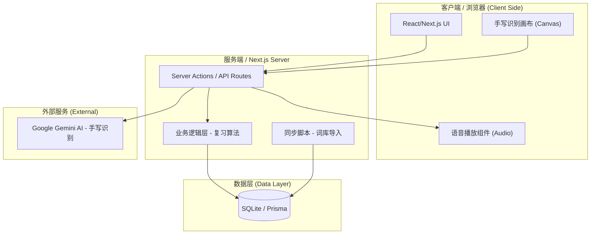
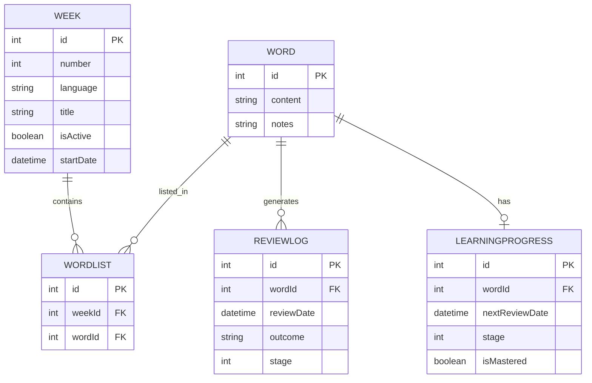
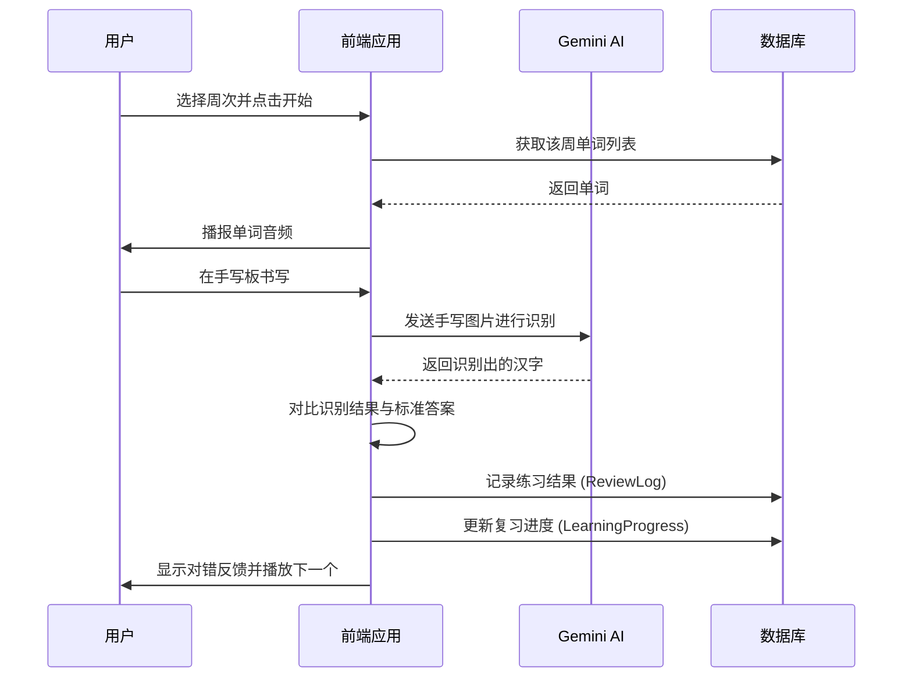
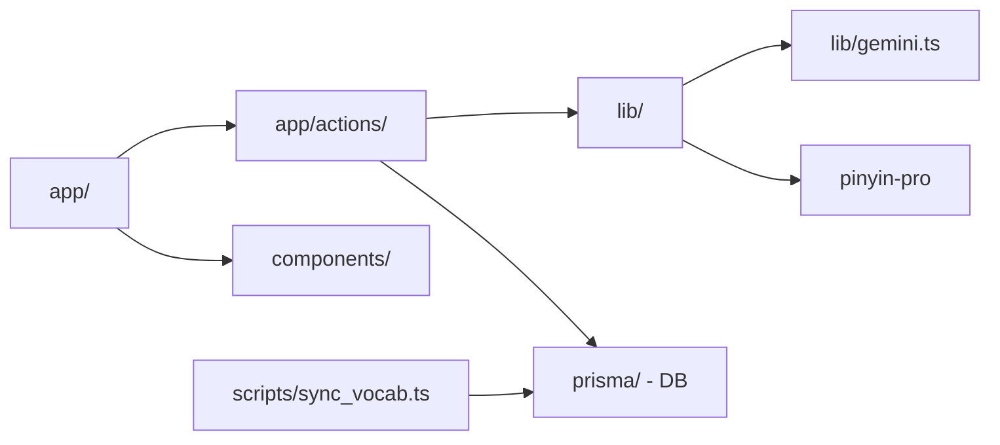

# Tingxie App 系统架构与模块图 (Mermaid)

本文件包含了 Tingxie App 的系统架构及其各模块之间的关系图。

> **注意 (Note)**: 
> 如果您使用 [Mermaid Live Editor](https://mermaid.live/)，请**仅复制**下方代码块（```mermaid ... ```）内部的内容，不要复制整个文件。每次只能渲染一个图表。

## 1. 系统整体架构图 (System Architecture)



## 2. 数据库模型关系图 (ER Diagram)



## 3. 听写练习流程图 (Logic Flow)



## 4. 模块依赖图 (Module Dependencies)


